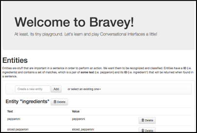
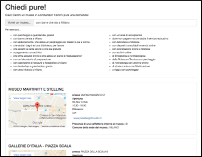
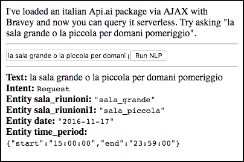
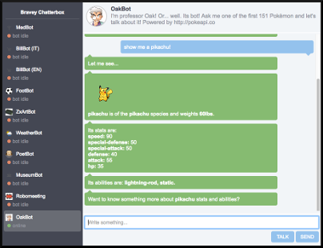
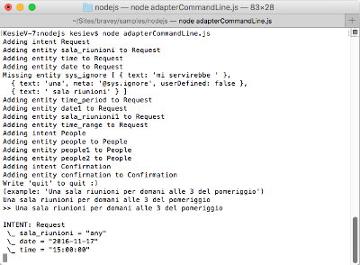
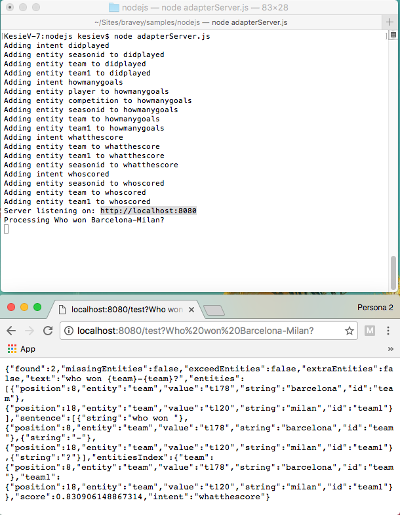

## Welcome to Bravey!
Bravey is a simple JavaScript [NLP](https://en.wikipedia.org/wiki/Natural_language_processing)-like library for conversational interfaces that can be used with Node.js or browser.
It's built for help you on joining the conversational interfaces bandwagon, so it should be easy enough to use, integrate and understand, so you can spice up your [bots](https://en.wikipedia.org/wiki/Internet_bot) or start creating your own.

Bravey was thought with simplicity in mind: it supports a number of processors, mostly based on [bayesian filters](https://en.wikipedia.org/wiki/Naive_Bayes_spam_filtering), with different features and accuracy and some customizable entity recognizers based on regular expressions chaining.

### Installation

#### Via NPM

Add Bravey to your project with your usual...

```
npm install bravey
```

... and your're ready to go.

```javascript
var Bravey = require("bravey");
var nlp = new Bravey.Nlp.Fuzzy();
nlp.addDocument("I want a pizza!", "pizza", { fromFullSentence: true, expandIntent: true });
nlp.addDocument("I want some pasta!", "pasta", { fromFullSentence: true, expandIntent: true });
console.log(nlp.test("Want pizza, please").intent);
// "pizza"
```

#### Via SCRIPT tag

Include the `bravey.js` or `bravey.min.js` you can find into the `build/` directory in your web page. It will be available after the page loading.

```html
<html>
    <head>
        <script src="bravey.js"></script>
    </head>
    <body onload="test()">
        What you want is... <span id='product'></span>!
    </body>
    <script>
        function test() {
            var nlp = new Bravey.Nlp.Fuzzy();
            nlp.addDocument("I want a pizza!", "pizza", { fromFullSentence: true, expandIntent: true });
            nlp.addDocument("I want some pasta!", "pasta", { fromFullSentence: true, expandIntent: true });
            document.getElementById("product").innerHTML=nlp.test("Want pizza, please").intent;
        }
    </script>
</html>
```

### Getting started

You can basically use Bravey from a single object.

```javascript
var nlp = new Bravey.Nlp.Fuzzy();
nlp.addDocument("I want a pizza!", "pizza", { fromFullSentence: true, expandIntent: true });
nlp.addDocument("I want some pasta!", "pasta", { fromFullSentence: true, expandIntent: true });
console.log(nlp.test("Want pizza, please").intent);
// "pizza"
```

You can extract some features from a sentence:

```javascript
var nlp = new Bravey.Nlp.Fuzzy();
nlp.addEntity(new Bravey.NumberEntityRecognizer("quantity"));
nlp.addDocument("I want 2 pizzas!", "pizza", { fromFullSentence: true, expandIntent: true });
console.log(nlp.test("Want 3 pizzas, please").entitiesIndex.quantity.value);
// 3
```

And some of them have language support too, like in english...

```javascript
var nlp = new Bravey.Nlp.Fuzzy();
nlp.addEntity(new Bravey.NumberEntityRecognizer("quantity"));
nlp.addEntity(new Bravey.Language.EN.TimeEntityRecognizer("delivery_time"));
nlp.addDocument("I want 2 pizzas at 12!", "pizza", { fromFullSentence: true, expandIntent: true });
console.log(nlp.test("Deliver 3 pizzas for 2pm, please").entitiesIndex);
// { delivery_time: { value: "14:00:00" }, quantity: { value:3 } }
```

... or italian.

```javascript
var nlp = new Bravey.Nlp.Fuzzy();
nlp.addEntity(new Bravey.NumberEntityRecognizer("quantity"));
nlp.addEntity(new Bravey.Language.IT.TimeEntityRecognizer("delivery_time"));
nlp.addDocument("Vorrei 2 pizze per le 3!", "pizza", { fromFullSentence: true, expandIntent: true });
console.log(nlp.test("Consegnami 3 pizze per le 2 del pomeriggio!").entitiesIndex);
// { delivery_time: { value: "14:00:00" }, quantity: { value: 3 }}
```

... or even portuguese.

```javascript
var nlp = new Bravey.Nlp.Fuzzy();
nlp.addEntity(new Bravey.NumberEntityRecognizer("quantity"));
nlp.addEntity(new Bravey.Language.PT.TimeEntityRecognizer("delivery_time"));
nlp.addDocument("Quero 2 pizzas para 3:00!", "pizza", { fromFullSentence: true, expandIntent: true });
console.log(nlp.test("Me veja 3 pizzas para 2 da tarde!").entitiesIndex);
// { delivery_time: { value: "14:00:00" }, quantity: { value: 3 }}
```

That's it!

### Training Bravey

You can leave to Bravey intent and entity guessing...

```javascript
var nlp = new Bravey.Nlp.Fuzzy();
nlp.addDocument("I want a pizza!", "pizza", { fromFullSentence: true, expandIntent: true });
nlp.addDocument("I want some pasta!", "pasta", { fromFullSentence: true, expandIntent: true });
console.log(nlp.test("A pizza, please").intent);
// "pizza"
```

Or be more specific:

```javascript
var nlp = new Bravey.Nlp.Fuzzy();
nlp.addIntent("order_food", [{ entity: "food_name", id: "food_type" }, { entity: "number", id: "quantity" }]);
nlp.addIntent("order_drink", [{ entity: "drink_name", id: "drink_type" }]);

var drinks = new Bravey.StringEntityRecognizer("drink_name");
drinks.addMatch("coke", "coke");
drinks.addMatch("coke", "cola");
drinks.addMatch("mojito", "mojito");
drinks.addMatch("mojito", "moito");
nlp.addEntity(drinks);

var food = new Bravey.StringEntityRecognizer("food_name");
food.addMatch("pizza", "pizza");
food.addMatch("pizza", "pizzas");
food.addMatch("pasta", "pasta");
nlp.addEntity(food);

nlp.addEntity(new Bravey.NumberEntityRecognizer("number"));

nlp.addDocument("I want {number} {food_name}!", "order_food");
nlp.addDocument("I want {drink_name}!", "order_drink");

console.log(nlp.test("Want a moito, please"));
// { intent: "order_drink", entitiesIndex: { drink_type: { value: "mojito" } } }
console.log(nlp.test("I'd like 2 pizzas"));
// { intent: "order_food", entitiesIndex: { food_type: { value: "pizza" }, quantity: { value: 2 } } }
console.log(nlp.test("I'd like some pasta"));
// { intent: "order_food", entitiesIndex: { food_type: { value: "pasta" } } }
```

Have a look to the documentation for more ways for training NLP!

## Samples

Bravey includes a bunch of samples - you can find them into the "samples" directory.

### Browser samples

The "browser" subdirectory contains some samples you can test with your own browser. Most of them are runnable serving the project directory with any web server.

#### Playground sample

The "playground" sample quickly explains how most of the conversational interfaces NLP technologies works in English and allow you to play and visually configure a Bravey hinstance. Everything works in your browser so any server side scripting language is needed.



#### Opendata sample

The "opendata" sample show you how to search a database as-you-type using Bravey. In this case you'll search the Regione Lombardia's museum database opendata in Italian. This example uses a snapshot of that database, so any server side scripting language is needed.



#### Adapter sample

The "adapter" sample loads a Api.ai package via AJAX and allow you to prepare a query in a NLP-like way using Bravey. No server side scripting language is needed for this example.



#### Chatterbox sample

"Chatterbox" is a collection of bots built around Bravey. These samples are using a simple custom-built chat UI library called "Chatterbox" which simulates web chatrooms with single or multiple contacts you can use standalone or embed in your own site.
Some of these bots needs a PHP webproxy, which is shipped together with Chatterbox, in order to work properly. No database is needed, so just make sure you've PHP support (5.6.10+) if you want all the demos to work.



### Node.js samples

You can find more exampes into the "nodejs" directory. These examples uses Bravey from Node.js and are invoked from command line.

## Adapter (command line) sample

The "adapterCommandLine" example simply replicate the Adapter example within a Node.js hinstance.




## Adapter (server) sample

The "adapterServer" example uses the Node.js built-in web server in order to serve a single hinstance of Bravey and replies in Api.ai format.


